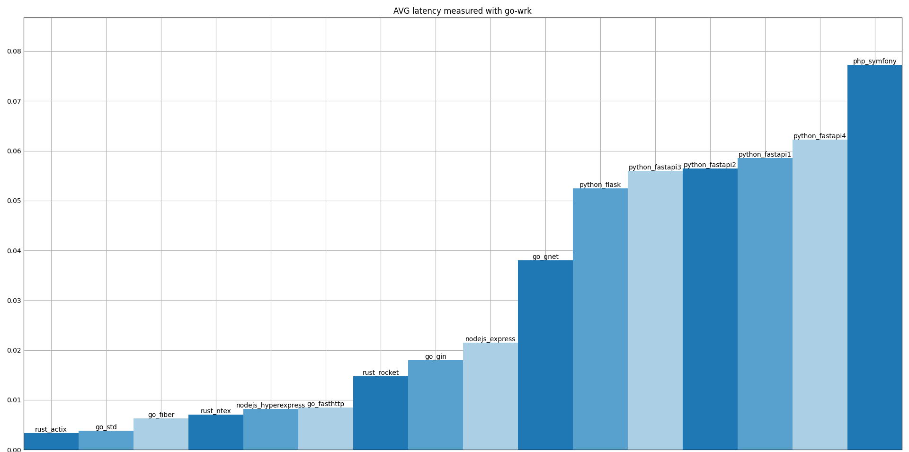
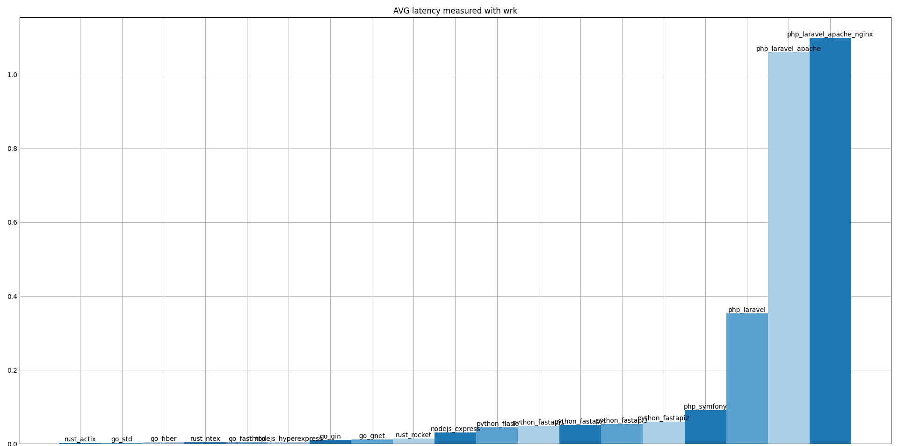
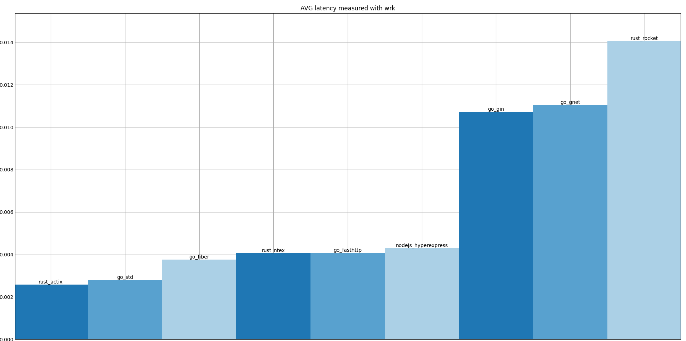

The idea of this project is to compare performance of languages and their frameworks

###### Goals of this project:
1. To get handy comparison results, performed by myself
2. To satisfy my curiosity about languages and performance
3. To practice writing performant and high-load software, measuring it, designing high-load systems

###### There will be 1 test(maybe i'll add second later for chosen technologies):
1. Plain text constant response without any logic behind it
2. More real usage: db requests, maybe caching with memcached/redis

###### Other:
1. Inspired by [Anton Putra](https://www.youtube.com/@AntonPutra)
2. I recommend you to look through his videos if you are interested in performance comparisons

---

###### Metrics:
1. CPU usage
2. Memory usage
3. Request latency(AVG and Max)
4. My subjective opinion

###### Testing methodology:
1. Serial order of testing: run docker, run 3 stress testing tools one by one
2. So we use 256MiB of `--memory` for docker run and 512MiB for `--memory-swap`

###### Measuring methodology:
1. [Prometheus](https://prometheus.io) + [Grafana](https://grafana.com/)
2. My own tool on go + plotting with python matplotlib
3. [wrk](https://github.com/wg/wrk), [go-wrk](https://github.com/tsliwowicz/go-wrk)

wrk consistently outperforms go-wrk and my own tool x1.5-x2

---

###### Versions:
 - `rustc --version` -> `rustc 1.85.0 (4d91de4e4 2025-02-17)`
 - `go version` -> `go version go1.24.0 linux/amd64`

---

### Results:

#### Subjective
Go //Looks like best language now for performance/ease of use
1. Gin -- fast and simple to use(at least for simple things) (12M release file)
2. Gnet -- feels like writing using simple tcp sockets, takes time and adds complexity (6.4M)
3. Stdlib net/http -- fast to use, but i like Gin/Fiber more (7.9M)
4. Fiber -- simple to use, just like Gin (9.3M)
5. FastHttp -- something between Gnet and Gin, i think (7.6M)

Rust //Complex thing, but i would use it if Go didn't exist, probably, or if i need more control/performance
1. Actix -- i would give it second place after rocket (release file if 5.8M)
2. Rocket -- nice and simple, i like it(based on this simple project, unsure about something bigger) (4.9M)
3. Faf -- like gnet on Go with rust "things" -- "newborn" thread 0 or thread 1 overflows it's stack even when handler just returns 0 or when using example code
4. Ntex -- same as actix(but release file is 4.3M)

JS
1. Express.js -- fast to make simple project
2. Hyperexpress -- also easy to use -- impressed me with really low latency

Python
1. Flask -- quite easy
2. FastAPI -- feels on par with flask, maybe docs are not so good

PHP
1. Symfony -- feels a little lighter than Laravel, but mostly same verdict; not easy to dockerize
2. Laravel -- big and complex framework, i wouldn't consider it for microservice - but i would use it to create website

---

Zig //I really like the idea of zig, i want to like zig; but i don't like it's syntax sadly; i'll play with zig later
1. ZZZ -- 
2. ZAP -- 
3. Stdlib -- 

Nim //Seems quite raw to me, i'll test it later; but i wouldn't consider it for production anyways
1. Httpbeast -- 
2. Jester -- 
3. Stdlib -- 

---

#### Objective

###### AVG latency by go-wrk

###### AVG latency by wrk

###### AVG latency by my_util

---

###### Max latency by go-wrk

###### Max latency by wrk

###### Max latency by my_util

---

###### CPU usage under stress from go-wrk
###### CPU usage under stress from wrk
###### CPU usage under stress from my_util

---

###### Mem usage under stress from go-wrk
###### Mem usage under stress from wrk
###### Mem usage under stress from my_util

---

#### Conclusions

###### Nginx vs Apache2
1. Apache2(at least in naive aproach with default configs) is not good for handling of massive amounts of connections at the same time
2. Putting nginx as reverse proxy in front of apache2 slightly improved situation (success rate 0% -> ~3%)
3. Using nginx with php-fpm improved it a lot more (~3% -> solid 100%)

###### PHP vs JS vs Python
1. Laravel is a big and complex framework, symfony is lighter and faster
2. Still, even python flask and FastAPI are faster
3. FastAPI being slower than Flask in some tests is probably caused by using `gunicorn -w 2` for Flask and `uvicorn --workers 1` for FastAPI (i'll test it later)
4. ExpressJS is better than FastAPI and Flask in this test, even through i run it with simple `node index.js`
5. It would be interesting to see ExpressJS performance with Bun and/or PM2
6. Hyper-Express did really good, i didn't expect it to be on par with rust and go

###### Go, Rust
1. Rocket(Rust), Gnet(Go) and Gin(Go) are almost on the same level
2. Ntex(Rust), Fasthttp(Go), Fiber(Go), Actix(Rust) and Go's stdlib's realisation are even faster

